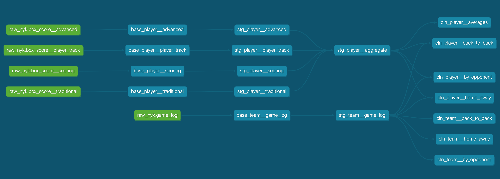

# NBA Player Analytics

This analytics pipeline is composed of the following steps:

* **EXTRACT** - Data is procured from the NBA's API (*see `src/api_helpers.py`*)
* **LOAD** - Data is loaded into BigQuery via a custom wrapper (*see `src/utilities/bigquery.py`*)
* **TRANSFORM** - Raw BigQuery data is cleaned and reshaped with `dbt` (*see `nba_dbt/`*)

## Running Checklist
- [x] Python API is successfully writing to BigQuery project 
- [x] Clean dbt models (base + staging) are well defined and run without test failures
- [x] Summary dbt models accurately join tables together to offer insights about players and games
- [ ] Prefect workflow set up to run on a daily cadence
- [x] Dev and production datasets managed by Terraform
- [ ] Google Artifact Registry is managed by Terraform
- [ ] Prefect blocks are set up for authentication
